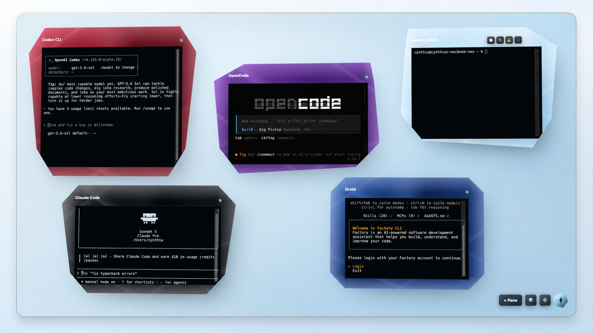

# WindowPanes

**A local desktop command center for AI coding CLIs.**

WindowPanes gives Claude Code, Codex CLI, Droid, OpenCode, Reasonix, Pi, Hermes, OpenClaw, and ordinary shells their own movable terminal panes. Arrange your agents, keep their sessions visible, save layouts, and run everything locally without handing WindowPanes your provider credentials.

[](https://github.com/cynthiablankenship/WindowPanes/releases/latest)
[](https://github.com/cynthiablankenship/WindowPanes/actions/workflows/ci.yml)
[](LICENSE)
[](https://www.electronjs.org/)



## Why WindowPanes?

AI coding tools are powerful, but juggling them across scattered terminal windows gets messy fast. WindowPanes keeps the work local and visible:

- **One workspace for many agents**: launch different CLIs side by side instead of hunting through separate terminal windows.
- **Local-first by design**: WindowPanes starts local commands through `node-pty`; provider login, API keys, sandboxing, and behavior stay inside each CLI.
- **Saved pane layouts**: arrange, resize, overlap, hide, restore, and reopen workspaces without rebuilding your desk every time.
- **Built-in setup flow**: missing CLIs can be selected from the app and installed through explicit, visible terminal commands.
- **Custom profiles**: add any local command, script, shell, REPL, or project tool as its own pane.

## Supported Profiles

WindowPanes ships with built-in profiles for:

| Profile | Command |
| --- | --- |
| Claude Code | `claude` |
| Codex CLI | `codex` |
| Factory Droid | `droid` |
| OpenCode | `opencode` |
| Reasonix | `reasonix` |
| Pi | `pi` |
| Hermes | `hermes` |
| OpenClaw | `openclaw` |
| Generic Shell | your system shell |

You can also create custom profiles for any command on your machine.

## Download

Grab the latest build from [GitHub Releases](https://github.com/cynthiablankenship/WindowPanes/releases/latest).

Current packaging targets:

- **macOS**: unsigned Apple silicon DMG
- **Windows**: NSIS installer
- **Linux**: first-pass AppImage

macOS builds are currently unsigned. If macOS blocks the first launch, open **System Settings** -> **Privacy & Security** and approve WindowPanes, or right-click the app and choose **Open**.

## Philosophy

WindowPanes is a terminal host, not an agent harness. It does not proxy provider APIs, collect credentials, inject prompts, hide arguments, auto-send text, add hidden tools, or log terminal transcripts by default. Each provider CLI remains responsible for its own authentication and behavior.

## Development Setup

Prerequisites:

- Node.js 22 or newer
- npm 10 or newer
- Native build tools capable of compiling Node modules. On Windows, install the Visual Studio Build Tools C++ workload if `node-pty` fails to compile.

Install dependencies:

```bash
npm install
```

## Development Commands

Run the desktop app during development:

```bash
npm run dev
```

Run the experimental gemstone lab during development:

```powershell
npm run dev:gemstone
```

The stable app loads `src/renderer/`. The gemstone lab loads `src/renderer-gemstone/` through the separate `gemstone.html` entry and does not replace the production renderer.

Build the gemstone renderer as the default packaged app:

```bash
npm run package:win:gemstone
npm run package:mac:gemstone
npm run package:linux:gemstone
```

This writes the unpacked gemstone app to:

```text
dist/mac-arm64/WindowPanes.app
```

Create local gemstone installers:

```bash
npm run dist:win:gemstone
npm run dist:mac:gemstone
npm run dist:linux:gemstone
```

The gemstone package keeps the stable renderer source intact, but swaps the packaged default HTML entry to `gemstone.html` after the normal build. Public distribution should add Apple Developer signing and notarization before release.

Type-check, test, and build:

```bash
npm run typecheck
npm test
npm run build
```

## Packaging

Create the unpacked Gemstone Windows app folder for local testing:

```powershell
npm run package:win:gemstone
```

This command runs the Electron/Vite build first, then writes the unpacked Windows app to:

```text
dist/win-unpacked/WindowPanes.exe
```

Create the Gemstone Windows installer:

```powershell
npm run dist:win:gemstone
```

This command runs the Electron/Vite build first, then writes the NSIS installer to:

```text
dist/WindowPanes-Setup-0.2.7.exe
```

Create the unpacked Gemstone macOS app folder for local testing:

```bash
npm run package:mac:gemstone
```

This command runs the Electron/Vite build first, then writes the unpacked Gemstone macOS app to:

```text
dist/mac-arm64/WindowPanes.app
```

Create the Gemstone macOS disk image:

```bash
npm run dist:mac:gemstone
```

This command runs the Electron/Vite build first, then writes a local unsigned DMG to:

```text
dist/WindowPanes-0.2.7-arm64.dmg
```

Create the unpacked Gemstone Linux app folder for local testing:

```powershell
npm run package:linux:gemstone
```

This command runs the Electron/Vite build first, then writes the unpacked Linux app to:

```text
dist/linux-unpacked/WindowPanes
```

Create the Gemstone Linux AppImage:

```powershell
npm run dist:linux:gemstone
```

This command runs the Electron/Vite build first, then writes the AppImage to:

```text
dist/WindowPanes-0.2.7-x86_64.AppImage
```

On Linux, make the AppImage executable and run it:

```bash
chmod +x dist/WindowPanes-0.2.7-x86_64.AppImage
./dist/WindowPanes-0.2.7-x86_64.AppImage
```

Linux packaging should ideally be validated on Linux before release because WindowPanes uses the native `node-pty` dependency.

For the maintained WSL Ubuntu 24.04 AppImage build workflow, including the exact Windows PowerShell commands and Linux GUI validation notes, see [docs/WSL_LINUX_APPIMAGE.md](docs/WSL_LINUX_APPIMAGE.md).

GitHub Actions validates pushes and pull requests to `main` on macOS, Windows, and Linux. Tagged releases matching `windowpanes-v*` build and publish Gemstone installers for macOS, Windows, and Linux. For CI behavior, release workflow behavior, and the exact release tagging commands, see [docs/RELEASES.md](docs/RELEASES.md).

Remove generated build and packaging output:

```powershell
npm run clean:dist
```

This deletes only `dist/` and `out/`. Those generated folders are ignored by Git; source icon assets in `assets/` remain tracked.

## Manual Release Smoke Test

Use this checklist before tagging or sharing a local v0.2 build:

- [ ] Run `npm run dev` and confirm the development app opens.
- [ ] Run `npm run dev:gemstone` and confirm the gemstone lab opens.
- [ ] On macOS, run `npm run package:mac:gemstone` and launch `dist/mac-arm64/WindowPanes.app`.
- [ ] On macOS, run `npm run dist:mac:gemstone` and confirm `dist/WindowPanes-0.2.7-arm64.dmg` is created.
- [ ] Run `npm run package:win:gemstone` and launch `dist/win-unpacked/WindowPanes.exe`.
- [ ] Run `npm run dist:win:gemstone` and confirm `dist/WindowPanes-Setup-0.2.7.exe` is created.
- [ ] On Linux, run `npm run package:linux:gemstone` and launch `dist/linux-unpacked/WindowPanes`.
- [ ] On Linux, run `npm run dist:linux:gemstone`, then `chmod +x dist/WindowPanes-0.2.7-x86_64.AppImage` and launch the AppImage.
- [ ] Install from the installer build and open WindowPanes.
- [ ] Confirm the app name is WindowPanes and the app/window icon is shown.
- [ ] Launch the **Generic Shell** profile.
- [ ] Launch the **Codex CLI** profile after confirming `codex` is installed and authenticated externally.
- [ ] Launch the **Claude Code** profile after confirming `claude` is installed and authenticated externally.
- [ ] Launch the **Droid** profile after confirming `droid` is installed and authenticated externally.
- [ ] Launch the **OpenCode**, **Reasonix**, **Pi**, **Hermes**, and **OpenClaw** profiles after confirming their matching CLIs are installed and authenticated externally.
- [ ] Resize a running **Droid** pane repeatedly across narrow/wide and tall/short app sizes; confirm Droid, Codex CLI, and Claude Code redraw acceptably.
- [ ] Switch Docked to Canvas, drag unlocked Pane 1, resize it from a corner, overlap Pane 2, click Pane 1 to bring it forward, lock/unlock panes, save, restart, and confirm mode, lock state, geometry, material, and z-order restore.
- [ ] In Canvas, start **Droid**, resize its floating pane, and confirm Droid remains running and redraws acceptably.
- [ ] Switch back to Docked and confirm the docked workspace still works.
- [ ] Add a custom profile, assign it to a pane, then delete the custom profile.
- [ ] Create, rename, save copy, and delete a layout.
- [ ] Switch layouts while terminals are running and confirm running terminals remain stable.
- [ ] Close the app with terminals running.
- [ ] Reopen the app and confirm no JavaScript error popup appears.

## Help / About

WindowPanes is a local terminal workspace. It launches local CLIs already installed on the user's machine.

WindowPanes does not manage provider authentication, API keys, prompts, or orchestration. Built-in profiles for Claude Code, Codex CLI, Droid, OpenCode, Reasonix, Pi, Hermes, and OpenClaw require those CLIs to be installed and authenticated outside WindowPanes. Custom profiles can launch arbitrary local commands.

## Branding

The user-facing app name is `WindowPanes`.

Icon assets live in `assets/`:

- `assets/icon.svg` is the editable source icon.
- `assets/icon.ico` is used for the Windows app/window/taskbar icon.
- `assets/icon.png` is the cross-platform fallback icon.
- `assets/icon.png` is used as the first-pass macOS package icon source.
- `assets/linux-icons/` contains size-specific PNGs used by Linux packages and AppImages.

The Electron runtime checks those paths at startup and uses the first existing raster icon, preferring `.ico` on Windows. To replace or update the icon later, edit or replace `assets/icon.svg`, regenerate `assets/icon.png` and `assets/icon.ico`, keep those filenames, and rebuild the app.

## Terminal Behavior

Terminal panes launch local commands through Electron main-process `node-pty`. The renderer sends spawn, write, resize, kill, and restart requests through the preload bridge only.

Command profiles are launched as their `command` plus `args` values. The app does not add hidden prompts, hidden arguments, provider credentials, or automatic input to a CLI.

## Gemstone Prototype Backgrounds

Gemstone background concept generation is paused. The live gemstone renderer is experimental and separate from the stable production renderer.

Use:

- Stable app: `npm run dev`
- Gemstone lab: `npm run dev:gemstone`
- Live gemstone renderer code: `src/renderer-gemstone/`
- Production renderer code: `src/renderer/`

The daily-use gemstone backgrounds are `Simple Glass`, `Simple Diamond`, `Simple Onyx`, `Simple Amethyst`, `Simple Cobalt`, `Simple Emerald`, `Simple Ruby`, `Simple Opal`, and `Original Grid`. `Simple Glass` is the default for new gemstone workspaces, and `Original Grid` must remain available. Future visual assets should be added through the live renderer background registry documented in [docs/GEMSTONE_BACKGROUNDS.md](docs/GEMSTONE_BACKGROUNDS.md). For the full branch-specific launch and separation notes, see [docs/GEMSTONE_LAB.md](docs/GEMSTONE_LAB.md).

## Provider Boundary

This app is a terminal host, not an agent harness. It launches local commands in panes and lets you organize them. It does not proxy provider APIs, store provider credentials, require API keys, perform provider OAuth, inject prompts, wrap or hide command arguments, auto-send text into a CLI, add hidden MCP tools, or log terminal transcripts by default. Each provider CLI remains fully responsible for its own authentication, login, sandboxing, permissions, and behavior. A pane behaves exactly like running the CLI in your own terminal.

## Troubleshooting node-pty Rebuilds

`node-pty` is a native dependency. If development or packaging fails with native module, `node-gyp`, MSBuild, or ABI errors:

1. Confirm Visual Studio Build Tools are installed with the C++ workload.
2. Confirm Python is available on PATH.
3. Rebuild the native module for the installed Electron version:

   ```powershell
   npm run rebuild
   ```

4. This project keeps native rebuilds as an explicit troubleshooting step instead of running `electron-builder install-app-deps` in `postinstall`, so a normal `npm install` does not unexpectedly require local C++ build tools.
5. If the rebuild still fails, remove `node_modules`, reinstall dependencies, and rerun the rebuild:

   ```powershell
   Remove-Item -Recurse -Force .\node_modules
   npm install
   npm run rebuild
   ```

6. Rerun validation:

   ```powershell
   npm run typecheck
   npm test
   npm run build
   npm run package:win:gemstone
   npm run dist:win:gemstone
   npm run package:linux:gemstone
   npm run dist:linux:gemstone
   ```
